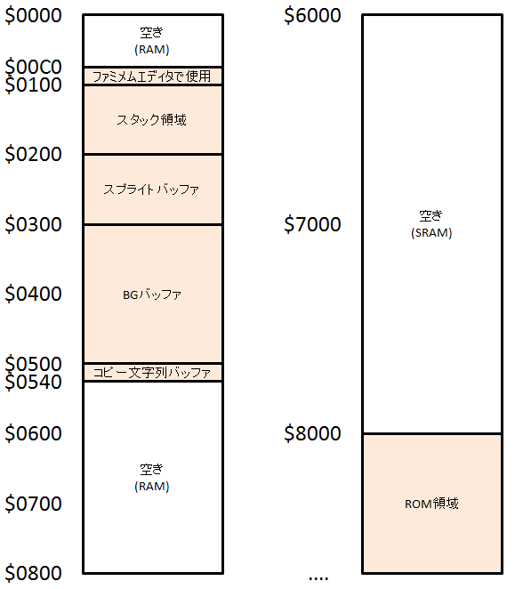

## ファミメムエディタ
作成日: 2019/12/01(日)   
更新日: 2022/06/05(日)  

---


### ■ 概要
ファミコン用メモリエディタです。  
入力した 16 進数を機械語としてそのまま実行する機能も備わっています。  
FamiMemEditor.nes : 【[ダウンロード](https://github.com/TheHaruking/FamiMemEditor/releases/download/v2.1/FamiMemEditor.nes)】

### ■ 実行方法

**パソコンで実行** : ファミコンエミュレーター ([Mesen](https://www.mesen.ca/ja/) 等) を用いて FamiMemEditor.nes を開く  
**レトロフリークで実行** : MicroSD に FamiMemEditor.nes を入れてメニューから起動

> ※レトロフリークで実行時は、[出力設定] で [オーバースキャン] : ON に設定下さい。でないと、左端が途切れます。

### ■ 操作方法

※ [ ] は、"押しながら" を意味します。

|||
|-|-|
| [A] + 十時キー | カーソル移動 |
| [十時キー] + A or B | 16進数値入力 (0x0-0xF) |
| [START] + ↑ or ↓ | 範囲選択 & コピー (行単位) |
| [START] + → | ペースト (行単位) |
| SELECT | 機械語として実行 (表示ﾍﾟｰｼﾞ先頭ｱﾄﾞﾚｽから) |
| [B] + ↑ or ↓ | メモリアドレス 0x40 分移動 |
| [B] + → | ニーモニック入力モード へ |
| [B] + ← | ページ移動モード へ |
|【ページ移動モード中】↑ or ↓ | メモリアドレス 0x40 分移動  |
|【ページ移動モード中】← or → | RAM (0x0000), SRAM(0x0600), ROM(0x8000) 間を移動 (0x0400 単位) |

---

### ■ サンプル1 : はじめての機械語

```
0000:A9 88 8D 20 
0004:00 60
```

十字キーを押しながら ABボタン で数値が入力できます。  
Aボタンを押しながら 十字キー でカーソル移動ができます。  
(ややこしいですが、慣れてみて下さい。)  
これを入力後、SELECT で実行すると、 0020 番地に 88 が書き込まれることを確認できます。  
この機械語は、「88 を読み込み(A9)、0020 番地に書き込み(8D)、戻る(60)」という命令です。  

88 の部分を自由に変えてみて下さい。  
0020 番地に書き込まれる値が変化します。  

後述の "ステップ実行機能" と "ニーモニック入力機能" を使用することで、1命令ずつ動作を確認したり、別の命令を試したりすることもできます。

---

### ■ 機能1. ステップ実行 & レジスタ表示機能


ファミメムエディタは 00 (BRK)命令に、ブレーク(一時停止)機能を実装してあります。  
なので、例えば各行の先頭に 00 命令を書いておくことで、1命令ごとの実行ができます。  
その際、レジスタ情報表示部が更新されるので、1命令ごとのレジスタの値の変化を確認することが出来ます。  

---

### ■ 機能2. ニーモニック入力機能


機械語だけでなく、ニーモニックでも入力出来るようになっています。  
B を押しながら → を押下すると、ウインドウが開き、選択できるようになります。

表示は大きく3つのカテゴリで分類しており、

**読み書き** | **計算** | **移動**

で分けています。

---
### ■ サンプル2 : BPS社サウンドロゴ似の音

少し長いですが、実行すると音が鳴ります。

```
0000:A2 00 A0 00
0004:A5 24 91 20 
0008:B5 28 91 22 
000C:E8 C8 EA EA 
0010:E0 08 D0 F4 
0014:60 00 00 00 
0018:00 00 00 00 
001C:00 00 00 00
0020:15 40 00 40 
0024:03 00 00 00 
0028:B8 AF FF 03 
002C:B8 AF FC 03 
0030:00 00 00 00 
0034:00 00 00 00 
0038:00 00 00 00 
003C:00 00 00 00
```

上記の機械語をアセンブリで表すと、以下となります。

```LLVM
; x, y ﾚｼﾞｽﾀ に 0 代入。
ldx #$00
ldy #$00
; $24 から a ﾚｼﾞｽﾀ に読み込み、
; a ﾚｼﾞｽﾀ の値を $20 が指すｱﾄﾞﾚｽ($4015) + y 番地 に書き込む。
lda $24
sta ($20), y
; ここから繰り返し処理
-
    ; $28 + x 番地の値を a に読み込み、
    ; $22 が指すｱﾄﾞﾚｽ($4000) + y 番地 に書き込む。
    lda $28, x
    sta ($22), y
    ; x, y を 1足す。(nop は何もしない命令)
    ; "x != 8" だった場合、"-" まで戻る
    inx
    iny
    nop
    nop
    cpx #$08
bne -
; 実行元に戻る
rts

; パディング
.db    0, 0, 0
.db 0, 0, 0, 0
.db 0, 0, 0, 0

;---------------------------------------------
DATA_dst_Address:
    ; [$4015]ﾁｬﾝﾈﾙ有効ﾚｼﾞｽﾀ, [$4000]矩形波1 制御ﾚｼﾞｽﾀ
    .dw $4015, $4000
DATA_src_4015:
    ; [$4015] 矩形波1, 2有効 (0, 0, 0 は パディング)
    .db $03, 0, 0, 0
DATA_src_4000:
    ; [$4000-$4003] 矩形波1 [ 音色･音量 | ｽｲｰﾌﾟ | 周波数下位 | 周波数上位 (ｷｰｵﾝ/ｵﾌ) ]
    ; [$4004-$4007] 矩形波2 [ 音色･音量 | ｽｲｰﾌﾟ | 周波数下位 | 周波数上位 (ｷｰｵﾝ/ｵﾌ) ]
    .db $B8, $AF, $FF, $03 
    .db $B8, $AF, $FC, $03
```

---
参考 : [https://dic.nicovideo.jp/a/fc音源](https://dic.nicovideo.jp/a/fc音源)  

上記リンク先に書かれておりました
>10 POKE &H4015,3  
>20 POKE &H4000,&HB8,&HAF,255,3,&HB8,&HAF,252,3  

を、機械語で書き直したものです。

---

### ■ メモリマップ



**プログラム可能領域**

上記図の「空き」と書かれている3箇所が読み書き可能な領域です。

- **$0000 ~ $00BF** : RAM の空き領域  
- **$0540 ~ $07FF** : RAM の空き領域  
- **$6000 ~ $7FFF** : SRAM の空き領域 (電源を消しても残る)  

$0000 ～ $00BF でプログラムするのが基本です。
電源を消しても残しておきたいプログラムは、$6000  ～ $7FFF に書いておくとプログラムが残ります。

---

### ■ あとがき : このソフトで出来ること

ファミコンの CPU は "Ricoh 2A03" という CPU ですが、  
これは、"MOS 6502" という CPU の互換品です。(以後、6502 と表記します。)  
  
6502 は非常にシンプルな CPU で、はじめて遊ぶ CPU として相応しいと考えます。  
機械語は 151 個。ニーモニックだと **56** 個です。  
6502 の機械語はいわば、コンピュータ界の **ひらがな** と言えます。  

(ところで、Linux を作ったリーナス・トーバルズ氏も、バルーンファイトの岩田聡さんも、少年時代にこの CPU に触れていたそうな。6502 には人とコンピュータの距離を縮める力があるのでは？と勝手に想像しています。)  

さて、あなたもこのファミメムエディタで、  
コンピュータとのコミュニケーションを **"直接"** 味わってみませんか？

---

### ■ 更新履歴
- 2018/12/31(月) : 製作開始
- 2019/08/07(水) : 作り直し
- 2019/09/08(日) : 一通り完成。[はるへや.みんな](https://はるへや.みんな/🎮/製作物/ファミメムエディタ/) で公開
- 2019/09/10(火) : github にアップロード (ReadMe.txt を修正した上で ReadMe.md に変更)
- 2019/09/16(月) : [追加] コピー&ペースト機能
- 2019/09/16(月) : v1.0 リリース
- 2019/09/18(水) : [追加] レジスタ表示機能
- 2019/10/06(日) : [追加] ステップ実行時、ページが切り替わるように
- 2019/10/22(日) : [追加] ディスアセンブル表示機能
- 2019/10/28(月) : [追加] ニーモニック入力機能
- 2019/12/01(日) : v2.0 リリース
- 2022/06/05(日) : v2.1 リリース (B + ↑ or ↓ にメモリアドレス移動を割り当てた)
